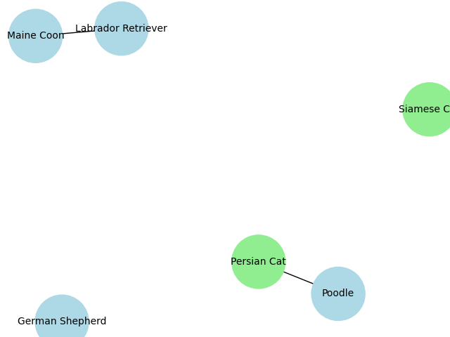

# Mental Map of Dog and Cat Breeds

This project creates a mental map to visualize the relationships between different breeds of dogs and cats using AI techniques. It leverages text descriptions of various breeds, processes the text data, calculates similarities, and visualizes the relationships in a graph format.

## Table of Contents
- [Introduction](#introduction)
- [Installation](#installation)
- [Usage](#usage)
- [Data Collection](#data-collection)
- [Data Preprocessing](#data-preprocessing)
- [Feature Extraction](#feature-extraction)
- [Similarity Calculation](#similarity-calculation)
- [Graph Construction](#graph-construction)
- [Visualization](#visualization)
- [Contributing](#contributing)
- [License](#license)

## Introduction
This project demonstrates how to create a mental map that visualizes the relationships between different breeds of dogs and cats. The map is created by:
1. Extracting features from textual descriptions using TF-IDF.
2. Calculating cosine similarity to define edges between nodes.
3. Visualizing the graph using NetworkX and Matplotlib.

## Installation
To run this project, you need to have Python installed along with the following libraries:
- NetworkX
- Matplotlib
- Scikit-learn

You can install the required libraries using pip:
```bash
pip install networkx matplotlib scikit-learn
```

## Usage
1. Clone the repository:
    ```bash
    git clone https://github.com/yourusername/mental-map-dogs-cats.git
    ```
2. Navigate to the project directory:
    ```bash
    cd mental-map-dogs-cats
    ```
3. Run the script to generate the mental map:
    ```bash
    python mental_map.py
    ```

## Data Collection
The data consists of descriptions of various dog and cat breeds. Each breed has a corresponding textual description that highlights its characteristics.

Example:
```python
breeds = {
    "Labrador Retriever": "Friendly and outgoing, Labs play well with others.",
    "Poodle": "Poodles are known for their intelligence and hypoallergenic coat.",
    "German Shepherd": "Confident and courageous, German Shepherds are versatile working dogs.",
    "Persian Cat": "Persians are known for their quiet and sweet personalities.",
    "Siamese Cat": "Siamese cats are social, vocal, and affectionate.",
    "Maine Coon": "Maine Coons are large, friendly, and known for their tufted ears."
}
```

## Data Preprocessing
Text descriptions are vectorized using TF-IDF to convert them into numerical features suitable for similarity calculation.

## Feature Extraction
TF-IDF (Term Frequency-Inverse Document Frequency) is used to transform the textual descriptions into numerical feature vectors.

## Similarity Calculation
Cosine similarity is calculated between the feature vectors to determine the similarity between breed descriptions. Edges in the graph are defined based on this similarity.

## Graph Construction
A graph is constructed where nodes represent breeds and edges represent high similarity between breed descriptions. Nodes are colored differently to distinguish between dogs and cats.

## Visualization
The graph is visualized using NetworkX and Matplotlib. Nodes are labeled with breed names and colored to indicate whether they represent a dog or a cat breed.

## Contributing
Contributions are welcome! Please open an issue or submit a pull request for any improvements or new features.

## License
This project is licensed under the MIT License.

---

### Example Script (mental_map.py)

```python
import networkx as nx
import matplotlib.pyplot as plt
from sklearn.feature_extraction.text import TfidfVectorizer
from sklearn.metrics.pairwise import cosine_similarity

# Sample data (descriptions of dog and cat breeds)
breeds = {
    "Labrador Retriever": "Friendly and outgoing, Labs play well with others.",
    "Poodle": "Poodles are known for their intelligence and hypoallergenic coat.",
    "German Shepherd": "Confident and courageous, German Shepherds are versatile working dogs.",
    "Persian Cat": "Persians are known for their quiet and sweet personalities.",
    "Siamese Cat": "Siamese cats are social, vocal, and affectionate.",
    "Maine Coon": "Maine Coons are large, friendly, and known for their tufted ears."
}

# Create a list of breed names and descriptions
breed_names = list(breeds.keys())
descriptions = list(breeds.values())

# TF-IDF Vectorization
vectorizer = TfidfVectorizer(stop_words='english')
X = vectorizer.fit_transform(descriptions)

# Calculate cosine similarity matrix
similarity_matrix = cosine_similarity(X)

# Create Graph
G = nx.Graph()
for i, breed in enumerate(breed_names):
    G.add_node(i, label=breed)

# Add edges based on similarity (only if similarity is above a certain threshold)
threshold = 0.1  # Adjust this threshold based on the desired level of connectivity
for i in range(len(breed_names)):
    for j in range(i+1, len(breed_names)):
        if similarity_matrix[i, j] > threshold:
            G.add_edge(i, j, weight=similarity_matrix[i, j])

# Assign colors to nodes based on type (dogs or cats)
node_colors = ['lightblue' if 'Cat' not in breed_names[i] else 'lightgreen' for i in range(len(breed_names))]

# Draw Graph
pos = nx.spring_layout(G, seed=42)  # Fixed seed for reproducibility
nx.draw(G, pos, with_labels=True, labels={i: breed for i, breed in enumerate(breed_names)}, node_color=node_colors, node_size=3000, font_size=10)
plt.title("Mental Map of Dog and Cat Breeds")
plt.show()
```


