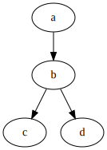

# YASM (Yet Another Smart Parser)

## Goal

The goal of this tool is to create an smart parser that analyise general logs
to find flow patterns and/or tests results

## Architecture

## Simpler parser mode

* The input is a general log that wwe want to analyse, for example in this [log](logs/simple.log)
* The user can define what patern is looking for, for example in the  [results-definition.xml](logs/results-definition.xml)

In this file the user will specify what patern is looking for and where in that
pattern the result should be taken , for example here:

```xml
<?xml version="1.0"?>
  <ResultsParser>
    <OutputTemplate>total perf  min(ms) #_RESULT_# avg(ms) </OutputTemplate>
  </ResultsParser>
```

* User can define the units on the file test-definition.xml

```xml

<?xml version="1.0"?>
  <TestInformation>
    <Title>testA</Title>
    <AppVersion>0.1</AppVersion>
    <Description>Description of why/what we parse goes here</Description>
    <ResultScale>seconds</ResultScale>
    <Proportion>LIB</Proportion>
    <TimesToRun>3</TimesToRun>
  </TestInformation>
```

* Once the system detects it on the log it will print the result:

```bash

yasm log
TestA = 1234 seconds 
Proportion : (LIB) Lower Is Better 
Description: 

```


## Flow events parser mode

In this mode once the parser has found one or many modes it finds the correlation of them over the execution flow printed on the log. We are going to use the Linux startup process [log](logs/dmesg) as example. 

Linux startup process is the multi-stage initialization process performed during booting a Linux installation. Booting a Linux installation involves multiple stages and software components, including firmware initialization, execution of a boot loader, loading and startup of a Linux kernel image, and execution of various startup scripts and daemons. 

When the kernel is loaded, it immediately initializes and configures the computer's memory and configures the various hardware attached to the system, including all processors, I/O subsystems, and storage devices. It then looks for the compressed initramfs image(s) in a predetermined location in memory, decompresses it directly to /sysroot/, and loads all necessary drivers. Next, it initializes virtual devices related to the file system, such as LVM or software RAID, before completing the initramfs processes and freeing up all the memory the disk image once occupied.

The kernel then creates a root device, mounts the root partition read-only, and frees any unused memory. At this point, the kernel is loaded into memory and operational. However, since there are no user applications that allow meaningful input to the system, not much can be done with the system.

Most of these stages are saved into the dmesg (diagnostic message). The dmesg print or control the kernel ring buffer. It offers 'levels.' of information such as: 

```
   emerg - system is unusable
   alert - action must be taken immediately
    crit - critical conditions
     err - error conditions
    warn - warning conditions
  notice - normal but significant condition
    info - informational
   debug - debug-level messages
```

If a user want to see the flow or secuence of all the warning codintions we can set one or multiple patterns we are looking for in different files such as:

State1.xml
```xml
<?xml version="1.0"?>
  <ResultsParser>
    <OutputTemplate>merg:
    </OutputTemplate>
  </ResultsParser>
```
State2.xml
```xml
<?xml version="1.0"?>
  <ResultsParser>
    <OutputTemplate>warning:
    </OutputTemplate>
  </ResultsParser>
```
 
 State2.xml
```xml
<?xml version="1.0"?>
  <ResultsParser>
    <OutputTemplate>error:
    </OutputTemplate>
  </ResultsParser>
```

The OutputTemplate can be multiple lines of pattern and describe as detailed as possible the state we are looking for. Once the parser found each of the patterns it will generate the flow diagram in DOT graph description language: 

```
digraph graphname {
    a -> b -> c;
    b -> d;
}

```

Which can be used to generate a diagram such as: 



### Smart Parser format

This format take multiple logs and based on the provided states in multiple xml files it find the pattern of states in common across the logs, for example: 

* Having multiple logs
* Provide the tool examples of logs form a passing/failing test/boot process
* Train the tool
* After the training the tool can now detect a passing/failing log


## Implementation

In perl, WIP

## Status

### Next steps


