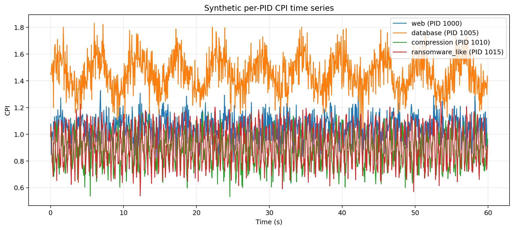
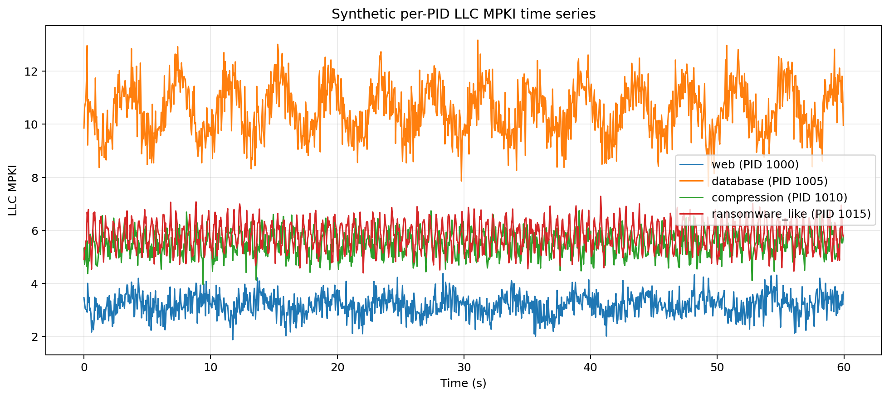
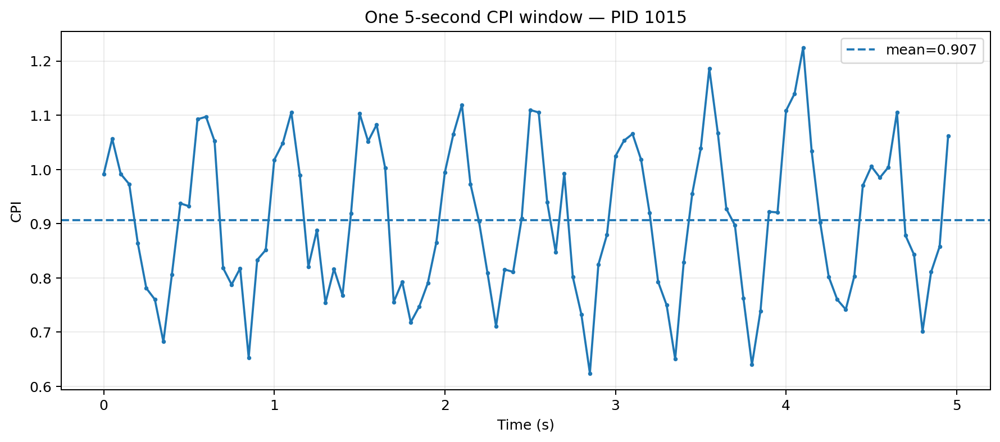
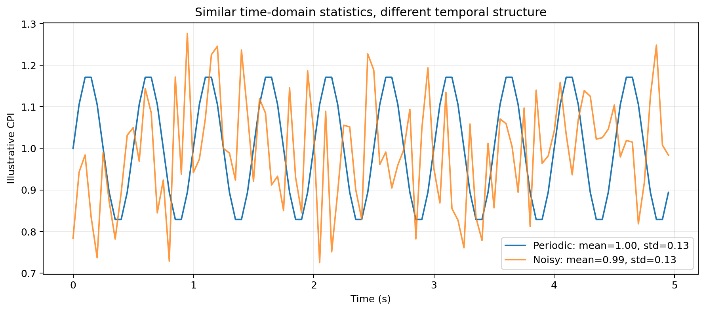
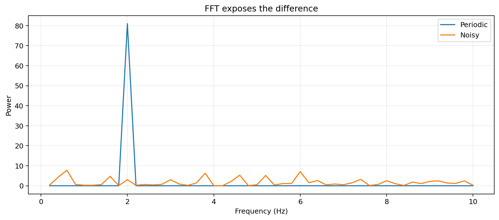
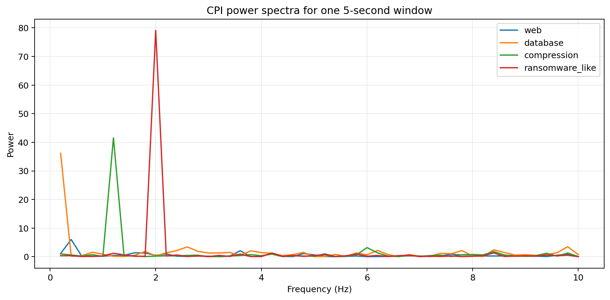
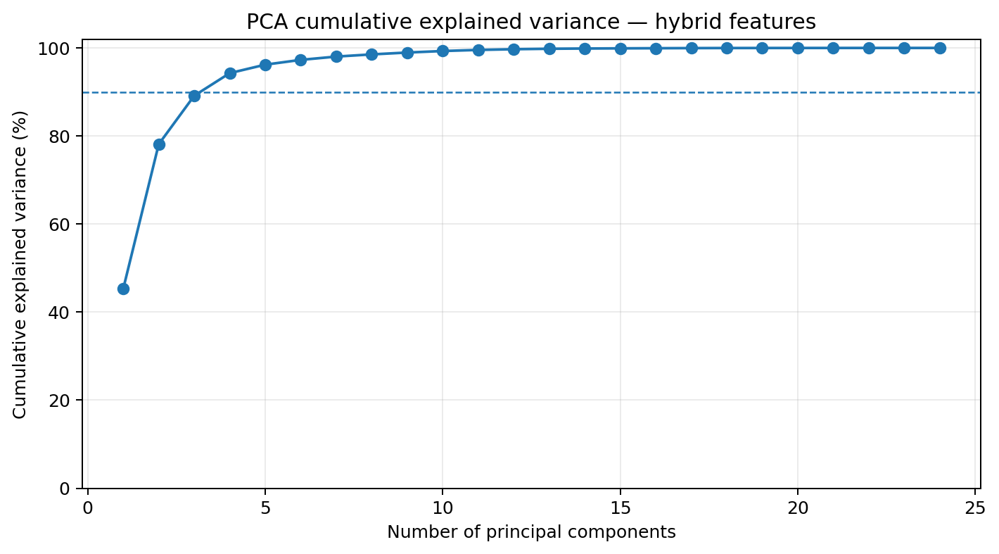
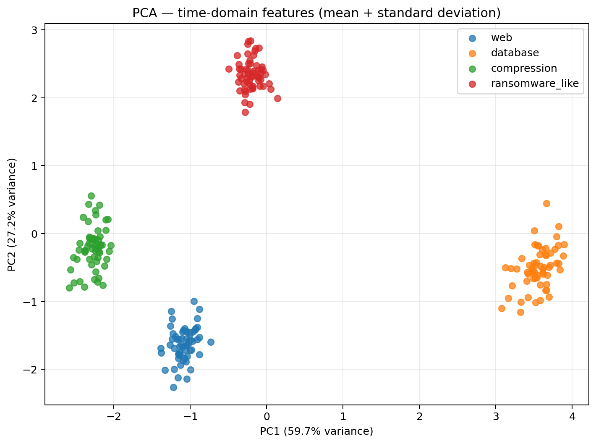
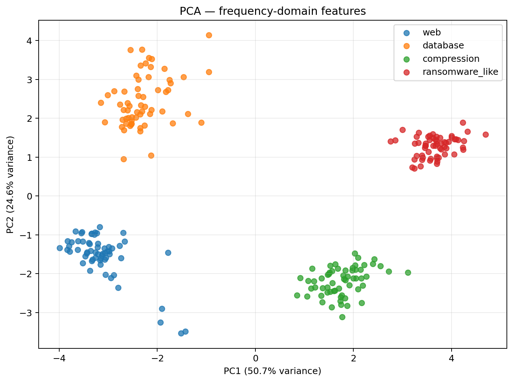
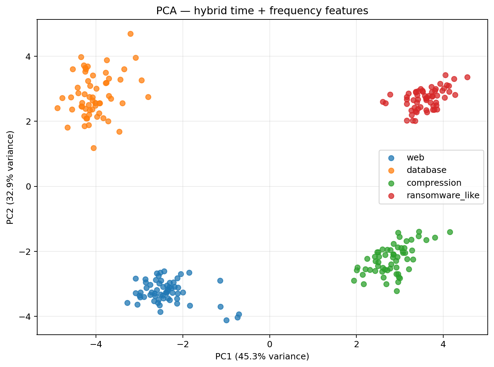

# PID-Level Microarchitectural Workload Characterization
## Time-domain, frequency-domain, and hybrid analysis with Intel PCM / PMU telemetry

> **GitHub rendering note:** Display equations use GitHub's fenced `math` blocks for reliable rendering across desktop and web views.

This tutorial develops a practical methodology for characterizing short execution windows from individual PIDs using microarchitectural measurements such as CPI, IPC, cache MPKI, branch MPKI, and related counters.

The long-term objective is to build an **online PID-level detector** that identifies processes whose microarchitectural behavior makes them good candidates for further ransomware investigation.

> **Important:** The synthetic `ransomware_like` class used by the accompanying Python example is educational only. It is not intended to represent a measured or validated ransomware microarchitectural signature.

---

# 1. Overall idea

For each active PID, Intel PCM or another PMU collection mechanism provides repeated measurements such as:

```math
\mathbf{x}_p(t)=
[
CPI(t),
IPC(t),
LLCMPKI(t),
BranchMPKI(t),
\ldots
].
```

Instead of waiting until the process finishes, execution is divided into short observation windows:

```math
W_{p,k}=
\{
\mathbf{x}_p(t_k),
\mathbf{x}_p(t_k+1),
\ldots,
\mathbf{x}_p(t_k+N-1)
\}.
```

Each window is treated as a **small workload instance** and converted into a fixed-length feature vector.

Conceptually:

```text
Active PIDs
    |
    v
Intel PCM / PMU samples
    |
    v
Short observation windows
    |
    +----------------------+
    |                      |
    v                      v
Time-domain           Frequency-domain
features              features
    |                      |
    +----------+-----------+
               |
               v
         Hybrid features
               |
               v
        Standardization
               |
               v
              PCA
               |
               v
        PC1 vs PC2 plots
               |
               v
   Clustering / classification
```

---

# 2. Why use time windows?

Suppose PCM samples a PID continuously.

A complete process execution may last seconds, minutes, or hours. Waiting until completion defeats the purpose of early detection.

Instead, divide execution into windows of duration $T_w$.

For example:

```text
PID 4821

0 s          5 s          10 s         15 s         20 s
|-------------|-------------|-------------|-------------|
   Window 1      Window 2      Window 3      Window 4
```

If the sample frequency is $f_s$ samples/second, then each window contains approximately

```math
N = f_s T_w
```

samples.

This creates a tradeoff:

- short windows reduce detection latency;
- long windows provide more stable statistical and spectral estimates.

The window length should therefore be treated as an experimental parameter.

---

# 3. Example raw microarchitectural signals

The synthetic example generates several classes:

- `web`
- `database`
- `compression`
- `ransomware_like`

Each synthetic PID produces time-varying CPI, IPC, LLC MPKI, and branch MPKI.

## CPI over time



The important point is that we are no longer characterizing only one complete workload. We are observing how the microarchitectural behavior evolves over time.

## LLC MPKI over time



Different workload classes can occupy different regions of the microarchitectural space, but they may also differ in **how their metrics vary over time**.

---

# 4. Time-domain characterization

The simplest useful feature is the mean.

For a metric $x$ with $N$ samples:

```math
\mu_x =
\frac{1}{N}
\sum_{i=1}^{N}x_i.
```

For CPI:

```math
\mu_{CPI}=
\frac{1}{N}
\sum_{i=1}^{N} CPI_i.
```

The mean describes the typical level of the metric within one window.

However, the mean alone loses information about variability.

Therefore we also calculate the standard deviation:

```math
\sigma_x=
\sqrt{
\frac{1}{N}
\sum_{i=1}^{N}
(x_i-\mu_x)^2
}.
```

The first practical time-domain representation is therefore:

```math
F_{time}=
[\mu,\sigma]
```

for every PMU metric.

For example, if we collect four metrics:

```math
CPI,\ IPC,\ LLCMPKI,\ BranchMPKI,
```

then a window becomes:

```math
\mathbf{f}_{time}=
[
\mu_{CPI},
\sigma_{CPI},
\mu_{IPC},
\sigma_{IPC},
\mu_{LLCMPKI},
\sigma_{LLCMPKI},
\mu_{BranchMPKI},
\sigma_{BranchMPKI}
].
```

---

# 5. One window as a small workload

The following figure shows one synthetic CPI window.



The horizontal line is the mean CPI during that window.

The main idea is:

> each observation window becomes one ML sample.

So instead of having one row per complete benchmark, we now have one row per:

```math

PID + time\ window

```

---

# 6. Why mean and standard deviation are not always enough

Consider two signals.

Signal A:

```math
A=[1,1,1,1,1]
```

Signal B:

```math
B=[0,2,0,2,1].
```

Both have:

```math
\mu_A=\mu_B=1.
```

But their temporal behavior is obviously different.

The standard deviation helps:

```math
\sigma_A=0
```

while

```math
\sigma_B>0.
```

However, even mean and standard deviation can fail to capture **how variation is organized in time**.

The following example deliberately creates two signals with similar first-order statistics but different temporal structure:



One is periodic. The other is mostly random.

This motivates frequency-domain analysis.

---

# 7. Frequency-domain characterization

For a discrete signal

```math
x[0],x[1],\ldots,x[N-1],
```

the Discrete Fourier Transform is:

```math
X[k]
=
\sum_{n=0}^{N-1}
x[n]
e^{-j2\pi kn/N}.
```

The FFT is an efficient algorithm for computing the DFT.

The magnitude

```math
|X[k]|
```

tells us how strongly each frequency component is represented.

A simple power representation is:

```math
P[k]=|X[k]|^2.
```

---

# 8. Remove the mean before spectral analysis

The zero-frequency FFT component is the **DC component**, which is strongly related to the signal mean.

To focus on temporal variation, first center the signal:

```math
x_c[n]=x[n]-\mu_x.
```

Then calculate:

```math
X_c[k]=FFT(x_c[n]).
```

This prevents the average level from dominating the spectral representation.

---

# 9. FFT can expose hidden temporal structure

The same two signals from the previous section look very different in the frequency domain:



The periodic signal concentrates much of its energy around one frequency.

The noisy signal distributes energy across many frequencies.

This means that frequency-domain features can potentially distinguish workload behaviors that look similar using only mean and standard deviation.

---

# 10. Useful frequency-domain features

Rather than feeding every FFT bin directly into the first ML experiment, summarize the spectrum.

## 10.1 Peak frequency

The dominant non-zero frequency is:

```math
f_{peak}
=
\underset{f>0}{\mathrm{arg\,max}}\,P(f).
```

## 10.2 Peak power

```math
P_{peak}
=
\max_{f>0}P(f).
```

## 10.3 Total spectral energy

```math
E=
\sum_{f>0}P(f).
```

## 10.4 Spectral entropy

First normalize the spectrum:

```math
p_k=
\frac{P[k]}
{\sum_j P[j]}.
```

Then:

```math
H_s=
-\sum_k
p_k\log_2(p_k).
```

Interpretation:

- low spectral entropy: energy concentrated in a small number of frequencies;
- high spectral entropy: energy distributed across many frequencies.

The resulting frequency-domain feature vector can be written as:

```math
\mathbf{f}_{freq}
=
[
f_{peak},
P_{peak},
E,
H_s,
\ldots
].
```

These quantities are calculated independently for selected PMU metrics.

---

# 11. Power spectra from synthetic CPI windows

The following plot shows the CPI spectrum for representative synthetic workload classes:



The synthetic `ransomware_like` class intentionally contains repetitive behavior so that the educational example clearly shows how the FFT can identify a dominant frequency.

Again, this is a demonstration of the methodology, not a claim about real ransomware behavior.

---

# 12. Sampling frequency matters

Spectral analysis depends critically on the sampling frequency.

If PCM measurements are collected at

```math
f_s
```

samples per second, the Nyquist frequency is:

```math
f_{Nyquist}
=
\frac{f_s}{2}.
```

The approximate FFT frequency resolution is:

```math
\Delta f
=
\frac{f_s}{N}.
```

Since

```math
N=f_sT_w,
```

we obtain:

```math
\Delta f
=
\frac{1}{T_w}.
```

This gives two useful design rules:

1. increasing $f_s$ allows higher-frequency behavior to be observed;
2. increasing $T_w$ improves frequency resolution.

For example, a five-second window sampled only once per second contains only five samples. That is usually too little information for useful FFT characterization.

---

# 13. Three feature representations

The experiment should compare three representations.

## A. Time domain

```math
F_{time}
=
[\mu,\sigma].
```

## B. Frequency domain

```math
F_{freq}
=
[
f_{peak},
P_{peak},
E,
H_s
].
```

## C. Hybrid representation

```math
F_{hybrid}
=
[
F_{time},
F_{freq}
]
```

The central research question becomes:

> Does frequency-domain information add discriminative information beyond conventional time-domain PMU statistics?

---

# 14. Constructing the ML dataset

Each row represents one PID during one time window.

Conceptually:

```text
PID   Window   Class             mu_CPI   std_CPI   CPI_peak_f   CPI_entropy
1000     0     web                ...       ...         ...          ...
1000     1     web                ...       ...         ...          ...
1007     0     database           ...       ...         ...          ...
1015     0     ransomware_like    ...       ...         ...          ...
```

The resulting feature matrix is:

```math
F
\in
\mathbb{R}^{M\times D},
```

where:

- $M$ = total number of PID/windows;
- $D$ = total number of extracted features.

---

# 15. Standardization before PCA

PMU and spectral features have very different numerical scales.

For feature $j$, standardization is:

```math
z_{ij}
=
\frac{
f_{ij}-\mu_j
}{
\sigma_j
}.
```

This produces approximately zero-mean, unit-variance features.

Without this step, a feature with a numerically large range can dominate the covariance matrix even if it is not intrinsically more important.

---

# 16. Principal Component Analysis

Let the standardized matrix be:

```math
Z.
```

Its covariance matrix is approximately:

```math
C
=
\frac{1}{M-1}
Z^T Z.
```

PCA solves the eigenvalue problem:

```math
C\mathbf{v}_i
=
\lambda_i\mathbf{v}_i.
```

The eigenvectors $\mathbf{v}_i$ define the principal-component directions.

The eigenvalues $\lambda_i$ describe the variance explained by those directions.

A sample $\mathbf{z}$ is projected onto principal component $i$ as:

```math
PC_i
=
\mathbf{z}\cdot\mathbf{v}_i.
```

---

# 17. PCA explained variance

Before looking only at PC1 and PC2, inspect how much information the principal components retain.



The cumulative explained variance is:

```math
EVR_{cum}(K)
=
\sum_{i=1}^{K}
\frac{\lambda_i}
{\sum_j\lambda_j}.
```

This tells us how many components are necessary to preserve most of the variance in the feature space.

---

# 18. PCA using only time-domain features

The first experiment uses only:

```math
\mu
\quad\text{and}\quad
\sigma.
```



Every point represents one PID/window.

This answers:

> Can short-window PMU averages and variability already separate workload behavior?

---

# 19. PCA using only frequency-domain features

Next use only spectral characteristics:

```math
f_{peak},
P_{peak},
E,
H_s.
```



This answers a different question:

> Can the temporal organization of the PMU signals separate behaviors even when their average values are similar?

---

# 20. PCA using hybrid features

Finally combine both domains:

```math
F_{hybrid}
=
[
F_{time},
F_{freq}
].
```



If frequency-domain information contributes useful independent information, the hybrid representation may improve class separation.

However:

> Better visual separation in a 2-D PCA plot does not automatically mean better classification accuracy.

PCA is unsupervised and maximizes variance, not class separation.

A supervised validation phase is still required.

---

# 21. Hard negatives are essential

The future ransomware experiment should not compare ransomware only against an idle machine or obviously different workloads.

The benign dataset should contain workloads that may be microarchitecturally similar to ransomware, such as:

- encryption;
- compression;
- backup;
- antivirus scanning;
- databases;
- compilation;
- storage-intensive workloads;
- memory-intensive workloads.

The real problem is:

```math

Ransomware
\quad
vs.
\quad
legitimate\ workloads\ with\ similar\ behavior

```

This is much more meaningful than simply learning:

```math
high\ CPU\ activity
\Rightarrow
ransomware.
```

---

# 22. From PCA to an online candidate detector

PCA and clustering are useful first steps for understanding the data.

The eventual detector would move toward a supervised estimate such as:

```math
P
(
RansomwareCandidate
\mid
W_{p,t}
).
```

For example:

```text
PID 4821

Window 1  -> benign
Window 2  -> benign
Window 3  -> suspicious
Window 4  -> suspicious
Window 5  -> suspicious
```

Instead of acting on one isolated prediction, the system can require persistence:

```math
P(R\mid W_{p,t})>\tau
```

for $K$ consecutive windows.

This can reduce false alarms caused by brief legitimate phase changes.

---

# 23. Detection latency

For a security-oriented system, classification accuracy is not enough.

A key metric is detection latency:

```math
T_{detect}
=
T_{alert}
-
T_{attack\ onset}.
```

Window length directly affects this quantity.

For example, if the detector requires a complete 10-second window before making a decision, its earliest detection is already constrained by the observation interval.

Therefore the experimental study should compare multiple values of:

```math
T_w.
```

---

# 24. Suggested first real-data experiment

A practical first experiment is:

1. collect per-PID PCM telemetry at a fixed sampling rate;
2. test multiple window sizes, for example 2 s, 5 s, and 10 s;
3. compute mean and standard deviation for every selected PMU metric;
4. compute FFT-based spectral features when enough samples are available;
5. build time-domain, frequency-domain, and hybrid datasets;
6. standardize each dataset;
7. run PCA;
8. inspect explained variance and PC1/PC2 distributions;
9. apply K-means as exploratory analysis;
10. train a supervised classifier after labels are available;
11. measure precision, recall, false-positive rate, and detection latency.

---

# 25. Files generated by the example

The accompanying Python demo produces:

```text
pcm_demo_output/
|
|-- synthetic_pcm_telemetry.csv
|-- features_time_domain.csv
|-- features_frequency_domain.csv
|-- features_hybrid.csv
|
|-- 01_raw_cpi_timeseries.png
|-- 02_raw_llc_mpki_timeseries.png
|-- 03_single_window_mean.png
|-- 04_similar_stats_different_structure.png
|-- 05_fft_periodic_vs_noise.png
|-- 06_cpi_power_spectra.png
|-- 07_hybrid_pca_explained_variance.png
|-- 08_pca_time_domain.png
|-- 09_pca_frequency_domain.png
|-- 10_pca_hybrid.png
```

The Python dependencies are:

```bash
pip install numpy pandas matplotlib scikit-learn
```

Run the example with:

```bash
python pcm_time_frequency_demo.py
```

---

# 26. Main takeaway

The fact that PCM produces time-series data does **not** mean that the first model must be an LSTM or Transformer.

A strong interpretable baseline is:

```math

PID\ telemetry
arrow
windows
arrow
time/frequency\ characterization
arrow
PCA
arrow
clustering/classification

```

The time-domain representation captures **how much** a metric changes.

The frequency-domain representation captures **how that change is organized in time**.

The hybrid representation combines both:

```math
F_{hybrid}
=
[
\mu,
\sigma,
f_{peak},
P_{peak},
E,
H_s,
\ldots
]
```

The next scientific question is therefore not merely whether FFT can be applied to PMU data.

It is:

> **Does spectral characterization provide additional information that improves PID-level discrimination of ransomware candidates from realistic benign workloads?**
